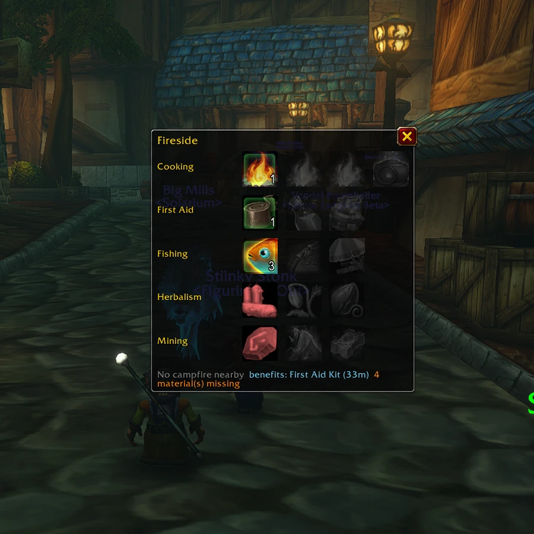

# Fireside



> Your WoW: Forever camping objects at a glance: what you can craft, what you are missing, and a minimap alert when a campfire is near.

**Status: 0.1.0 beta, built and tested on the Forever beta (client 1.60.1, interface 16001).** On CurseForge as [Fireside Camp](https://www.curseforge.com/wow/addons/fireside-camp).

---

## What it does

Forever's Camping system gives every profession its own campsite objects: the Mining **Lodestone**, the Blacksmithing **Sharpening Wheel**, the Herbalism **Incense Candle**, the Skinning **Camp Chair** and so on, up to three per profession as your skill grows (Cooking has five). You craft one (it lands in your bags), then use it next to a campfire; after a minute sitting there, everyone at the fire gets the benefits for an hour.

Fireside keeps all of that in one small panel, one row per profession, tiers left to right:

| Icon | Means |
|---|---|
| Gold glow | You can craft it right now |
| Green glow, pulsing | It is in your bags and a campfire is in range - click to place it |
| Green glow, dim | It is in your bags, no campfire nearby |
| Green glow, steady | A campfire kit you can light here |
| Red | Materials missing - the tooltip says which |
| Grey | Not learned yet - the tooltip says at which skill |

The tooltip of every object lists its materials as **have / need**, the tool it needs (the campfire wants Flint and Tinder), the buff it gives and the class buff it does not stack with. If you already carry that class buff yourself - a mage's own Arcane Intellect covers the Incense Candle - it tells you the object would add nothing for you.

### Around the campfire

- The **minimap button pulses** when you walk into a campsite's range, yours or anybody else's, with a short chime (`/fire sound` to pick it or turn it off).
- While you wait for the benefits, the panel counts down the minute: **benefits in 48 s**.
- Afterwards it reads your **Camp Benefits** and names the objects you are carrying, with the minutes left.

### Placing at the fire

Click a green icon and pick the spot on the ground: the object goes up next to the fire. A campfire kit works the same way to light a new camp. Away from a fire - or, for a kit, too close to one - the click tells you why instead of starting a placement the game would drop.

### Crafting from the panel

Click a gold icon with that profession's window open and it crafts. The client only allows a craft inside a real click with the profession window open, and does not let addons open that window, so the panel tells you which one to open when it is closed.

## Commands

| Command | Description |
|---|---|
| `/fire` | Toggle the panel (or click the minimap button) |
| `/fire mats` | List every material you are short of |
| `/fire all` | Show every profession, not just yours |
| `/fire minimap on\|off` | Show or hide the minimap button |
| `/fire sound on\|off\|<n>` | Campfire chime on or off, or pick and preview a sound |
| `/fire lock`, `/fire resetpos` | Lock the panel, reset panel and minimap button positions |
| `/fire log on\|off` | Record what Fireside sees, for bug reports (see below) |

`/fireside` works too. Shift-click the minimap button to reload the UI.

## Known limitations

- **Built and tested on an English client.** Professions are recognised by id and object names come from the game, so other client languages should work, but they are untested; effect descriptions are in English.
- **Recipe data ships with the addon** for every camping object in the game data. If a beta build changes a recipe, open that profession's window once and Fireside reads the live one from there.
- **The Alchemy Laboratory** has been announced but is not in the game data yet.

## Reporting a problem

1. Type `/fire log on` in game. Fireside starts recording what it sees: every click, craft and placement, the camp auras on you, and any Lua error.
2. Do what went wrong once more.
3. Type `/reload` (or log out) so the game writes the file, then send `WTF/Account/<your account>/SavedVariables/Fireside.lua` - attach it to a [GitHub issue](https://github.com/danilomagro/fireside/issues) or a comment on CurseForge.
4. `/fire log off` when you are done.

The file holds what Fireside recorded plus your character's name, level, class and professions; nothing from chat or from your account.

## Development

Deploy to a local client:

```powershell
.\scripts\deploy.ps1 -AddOnsPath "<your>\_classic_beta_\Interface\AddOns"
```

Then `/reload` in game: `ReloadUI()` is protected on this client, so addon reload buttons do not work.

`/fire log on` is also the developer switch: a probe of the client API, a log of every click, craft and placement, a harvest of recipes and auras, and a copy of Lua errors, all written to `FiresideDB`. `scripts/build_catalog.py` builds `Harvested.lua` from `scripts/wowhead_camp_objects.json` (the Wowhead Forever database) and, with `--harvest <file>`, from a live harvest, which wins.

Releases are built by the BigWigs packager on every version tag (`.github/workflows/release.yml`). While WoW: Forever is in beta every file is a Beta: tag `0.1.0-beta1`, `0.1.0-beta2` and so on; plain `1.0.0`-style tags, which make Release files, wait for the game's launch.

## Notes on the Forever client

The beta is a Mainline (retail) API client wearing a Classic game, and several things are broken in ways that shaped this addon. Measured on build 1.60.1.69913:

- **`GetItemInfo` / `GetSpellInfo` / `GetNumSkillLines` are gone.** Everything goes through `C_Item` / `C_Spell`, isolated in `Compat.lua`.
- **There is no camping API at all.** The only trace of what a campsite holds is on your own auras: `Campfire Nearby` (1283391) while in range, `Welcoming Campfire` (1229739 at player fires; 1289723 at ambient fires, per the Campfire Tales addon) for the 60 s wait - its tooltip is generic and never names the objects - and then a single `Camp Benefits` aura (1229741) whose tooltip lists every object on one line, separated by `\r\n`.
- **Secure snippets do not compile** (`loadstring_untainted` is missing). The panel only uses plain secure buttons with attributes set out of combat.
- **Registering an unknown event throws and aborts the file**, so every registration is wrapped.
- **Some values are secret** and must not be compared or used in arithmetic. Cooldown and aura reads are guarded and fall back to "unknown" rather than guessing.

### What crafting from an addon can and cannot do

| Route | Result |
|---|---|
| Secure button, `type="spell"` with the recipe id | no cast starts |
| Secure button, `/cast <recipe name>` | no cast starts |
| `C_TradeSkillUI.OpenRecipe` | **protected** - fires `ADDON_ACTION_BLOCKED` |
| `C_TradeSkillUI.CraftRecipe` from a timer or event | accepted silently, crafts nothing |
| `C_TradeSkillUI.CraftRecipe` inside the click, profession window open | **works** |

An addon cannot open a profession window either: a full spellbook dump returns only class and racial spells, with no profession entry to cast (only Cooking answers, through `GetProfessionInfo`).

Also measured:

- `C_Spell.GetSpellIDForSpellIdentifier` returns nil for recipe names.
- `GetAllRecipeIDs` keeps answering after the profession window closes, so it cannot tell whether one is open - Blizzard's frame plus the show/close events can.
- Registering a button for both click edges fires the secure action twice per click.
- `"item:<id>"` is not a valid target for the secure `item` attribute or for `/use`: both do nothing, silently, with no error. Address the item by name or by `"<bag> <slot>"`.
- Tools (Flint and Tinder) never appear in the reagent list the client returns, because they are not consumed, but they still block the craft.
- `Campfire Nearby` fires `UNIT_AURA` when you walk into range, but not when it is already on you at login.

## Changelog

### 0.1.0
- First release: camping objects panel, one row per profession, crafting from the panel, materials and tools in the tooltip
- Minimap button that pulses and chimes when a campfire is in range
- Welcoming Campfire countdown and Camp Benefits read-out
- Recipe ids harvested from a live beta client

---

*Author: Azareus - [github.com/danilomagro](https://github.com/danilomagro)*
